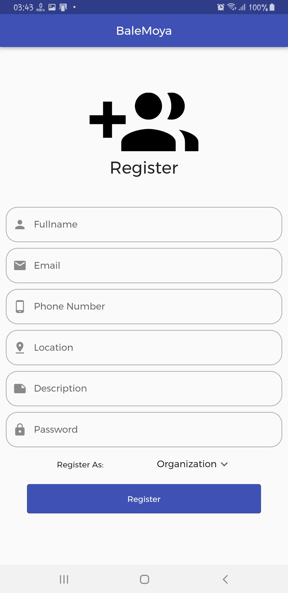

# Balemoya

### Team members name

Abiy Menberu

Bisrat Fekede 

Dan Mekonnen

Sintayehu Sermessa

### Advisor name

Mrs. Salem Getachew

## About The Project

BaleMoya is a multi-disciplinary platform that provides access to any professional at a moment's notice and also provides a platform where job applicants can look for job posts and employers/organizations/companies can post job memos. It eliminates the middleman by having a platform that connects you based on your area and the exact type of professional or work you are looking for. This platform provides either long term employment or a quick employment which can be looked at in two ways i.e. an urgent need for a professional like a doctor, plumber or repairman or a short-term employment that lasts for days or weeks at a time. It's frustrating when a simple technical problem happens or minor physical injury needs to be nursed but can't be addressed due to the lack of know-how.  We grant users and professionals a platform to easily get the information to contact each other. Our project intends to reduce the growing problem of unemployment as well as it creates the medium needed for the unemployed professionals to work as freelancers giving them more experience. Instead of using traditional methods of communication through brokers and word of mouth, we aim to try to eliminate the need for a third party by providing support using a platform where they can get the contact information easily and get in touch.

## Tools used
- Flutter - 
- GitHub for version control
- Vs Code and it's extensions for collaborated coding, and snippets
- Trello board

## Setup procedure

### Requirements

- Flutter SDK
- Android SDK (it comes with Android Studio)
- Device Emulator AVD

### Run the app

Install all dependencies

bash
pip install -r requirement.txt

To Start the app
export api/**init**.py

cmd
export FLASK_APP=API/__init__.py

./run.sh

or

bash
flask run

## UIs For The Application

<video width="480" height="320" controls="controls">
  <source src="screenshots/introductionScreen.mp4" type="video/mp4">
</video>

    

 

  

  

   

## References

https://www.freecodecamp.org/news/build-a-chat-app-ui-with-flutter/

https://www.youtube.com/watch?v=ZGT7eLPs59E

https://socket.io/get-started/chat

https://youtu.be/tMM9ty4Wfq0

https://www.youtube.com/watch?v=S6jFBiiP0Mc

https://www.youtube.com/results?search_query=bloc+unit+test+flutter

https://resocoder.com/2019/11/29/bloc-test-tutorial-easier-way-to-test-blocs-in-dart-flutter/
