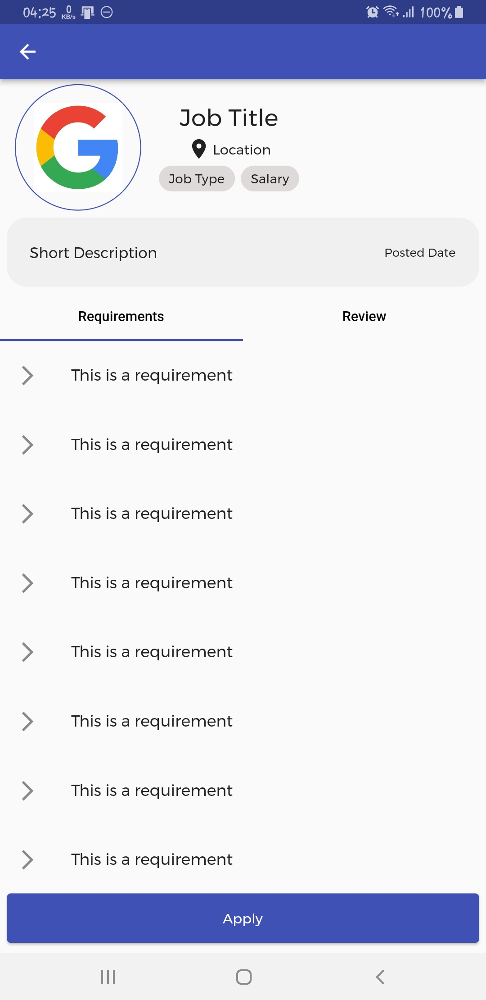
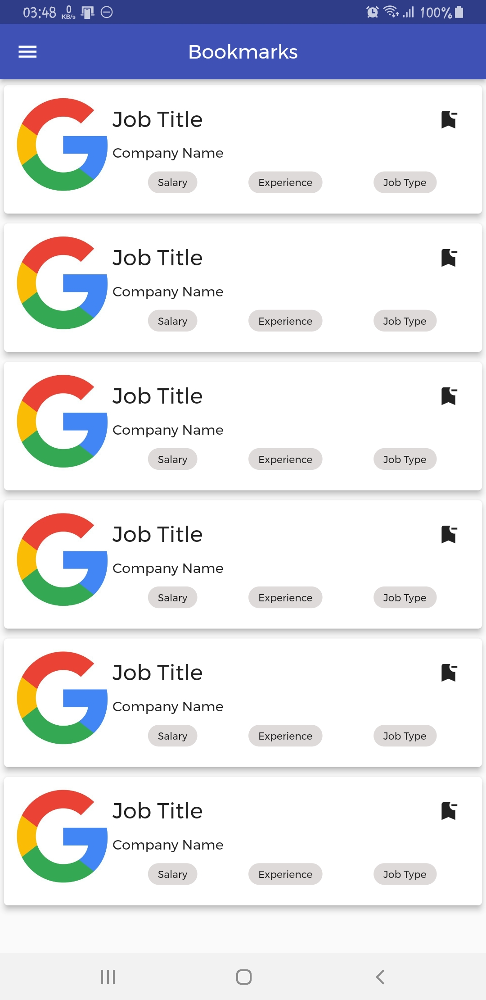
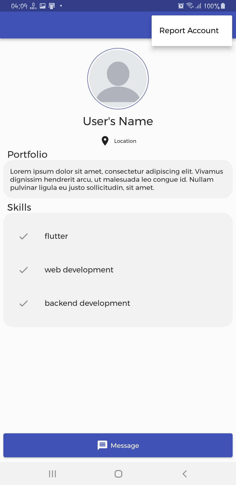
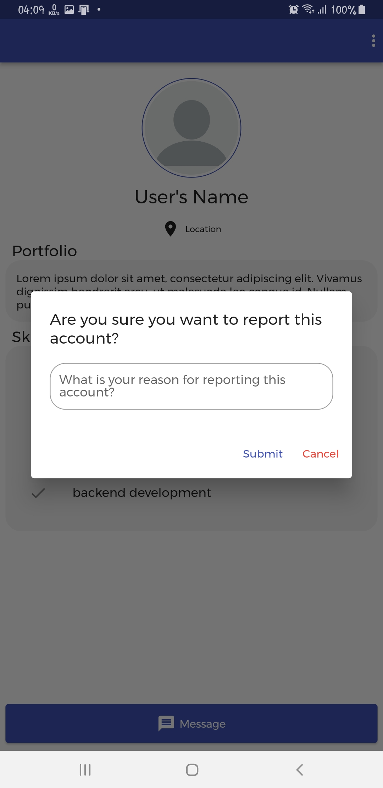

# BaleMoya

## Getting Started

This application is built upon flutter for the front-end (UI) by using [flutter_bloc](https://pub.dev/packages/flutter_bloc) for state management.

## UIs For The Application

[![Introduction Screen]
(https://i.ytimg.com/vi/Hc79sDi3f0U/maxresdefault.jpg)]
(https://user-images.githubusercontent.com/61845339/170804607-759cef77-d6b6-4cc6-82e2-b91cb8a8df9e.mp4 "Link")    // Video Link

)

    

  

  

  

   

  

### A few resources to get you started if this is your first Flutter project:

- [Lab: Write your first Flutter app](https://flutter.dev/docs/get-started/codelab)
- [Cookbook: Useful Flutter samples](https://flutter.dev/docs/cookbook)

For help getting started with Flutter, view our
[online documentation](https://flutter.dev/docs), which offers tutorials,

samples, guidance on mobile development, and a full API reference.
